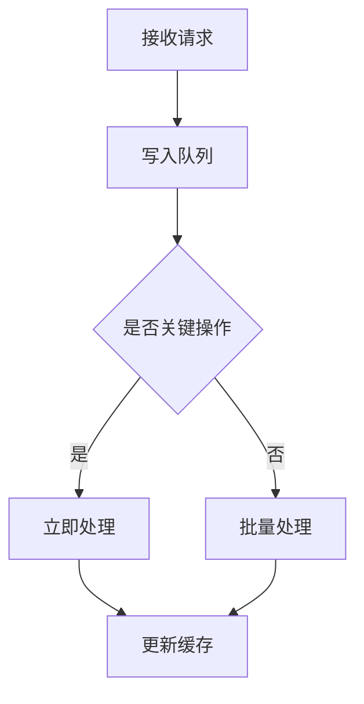

# 监控与运维文档

## 1. 监控指标

### 1.1 业务指标
- 剧本生成成功率
- 平均响应时间（P50/P95/P99）
- 知识库检索命中率
- AI服务调用成功率
- 用户活跃度
- 功能使用统计

### 1.2 系统指标
- CPU使用率
- 内存占用
- 磁盘IO
- 网络流量
- 服务健康状态
- 数据库性能

### 1.3 AI服务指标
- 模型调用量
- 响应时间
- 生成质量评分
- 知识库更新频率
- 缓存命中率

## 2. 日志规范

### 2.1 日志级别
- DEBUG: 开发调试信息
- INFO: 关键业务流程
- WARN: 可恢复的异常
- ERROR: 需要干预的错误
- FATAL: 系统崩溃级别

### 2.2 日志格式
```json
{
  "timestamp": "2024-03-21T09:30:00Z",
  "level": "ERROR",
  "service": "script-generator",
  "trace_id": "abc123",
  "error_code": "10000101",
  "message": "Invalid access token",
  "metadata": {
    "user_id": "u123",
    "ip": "192.168.1.1",
    "request_id": "req_456",
    "duration_ms": 150
  }
}
```

### 2.3 日志收集
- 使用ELK Stack收集和分析日志
- 实时日志告警
- 日志存储策略
- 日志清理策略

## 3. 性能优化

### 3.1 缓存策略
- 查询结果缓存：Redis（TTL 5分钟）
- 向量缓存：LRU内存缓存（最大1GB）
- 元数据缓存：Caffeine本地缓存
- 会话缓存：Redis集群
- 静态资源缓存：CDN

### 3.2 异步处理


### 3.3 数据库优化
- 索引优化
- 查询优化
- 连接池管理
- 读写分离
- 分库分表策略

## 4. 告警系统

### 4.1 告警级别
- P0: 紧急（系统宕机）
- P1: 严重（功能故障）
- P2: 警告（性能下降）
- P3: 提示（阈值预警）

### 4.2 告警渠道
- 邮件通知
- 短信通知
- Slack通知
- 微信通知
- 电话通知

### 4.3 告警规则
- CPU使用率 > 80%
- 内存使用率 > 85%
- 接口响应时间 > 2s
- 错误率 > 1%
- 磁盘使用率 > 90%

## 5. 运维流程

### 5.1 发布流程
1. 代码审查
2. 测试验证
3. 预发布验证
4. 灰度发布
5. 全量发布
6. 监控观察

### 5.2 故障处理
1. 故障发现
2. 初步诊断
3. 通知相关人员
4. 故障修复
5. 原因分析
6. 复盘总结

### 5.3 容量规划
- 资源使用趋势分析
- 容量预测
- 扩容阈值设定
- 成本优化

## 6. 监控工具

### 6.1 系统监控
- Prometheus
- Grafana
- Node Exporter
- cAdvisor

### 6.2 应用监控
- APM工具
- 链路追踪
- 日志分析
- 性能分析

### 6.3 业务监控
- 自定义指标
- 业务大盘
- 报表系统
- 数据分析 