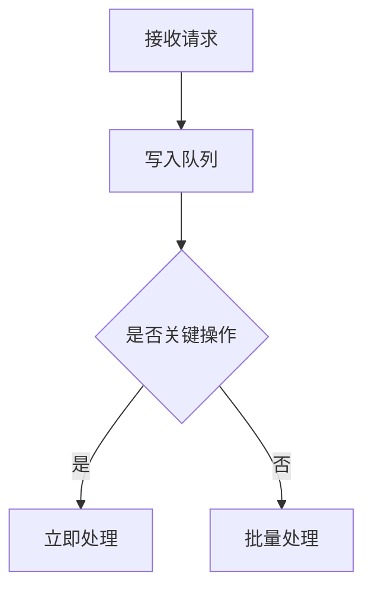

## 性能优化策略
### 缓存设计
- 查询结果缓存：Redis（TTL 5分钟）
- 向量缓存：LRU内存缓存（最大1GB）
- 元数据缓存：Caffeine本地缓存

### 异步处理

```mermaid
graph TD
    A[接收请求] --> B[写入队列]
    B --> C{是否关键操作}
    C -->|是| D[立即处理]
    C -->|否| E[批量处理]
``` 