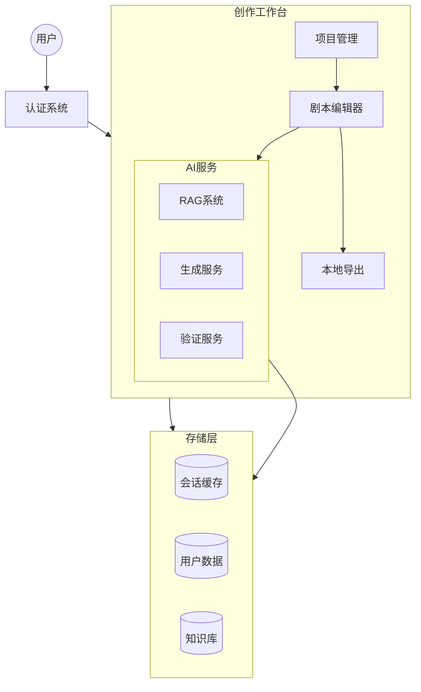
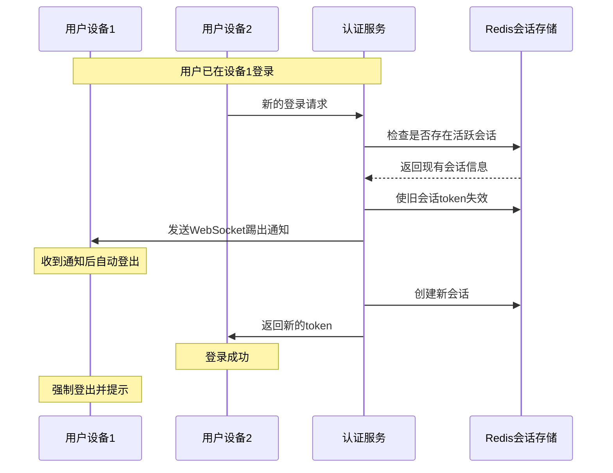
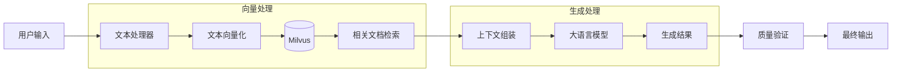
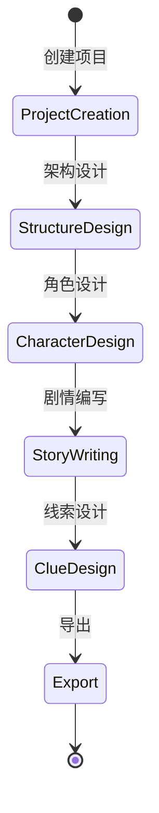
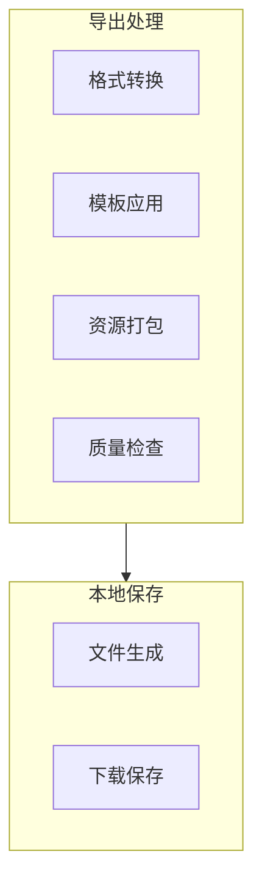
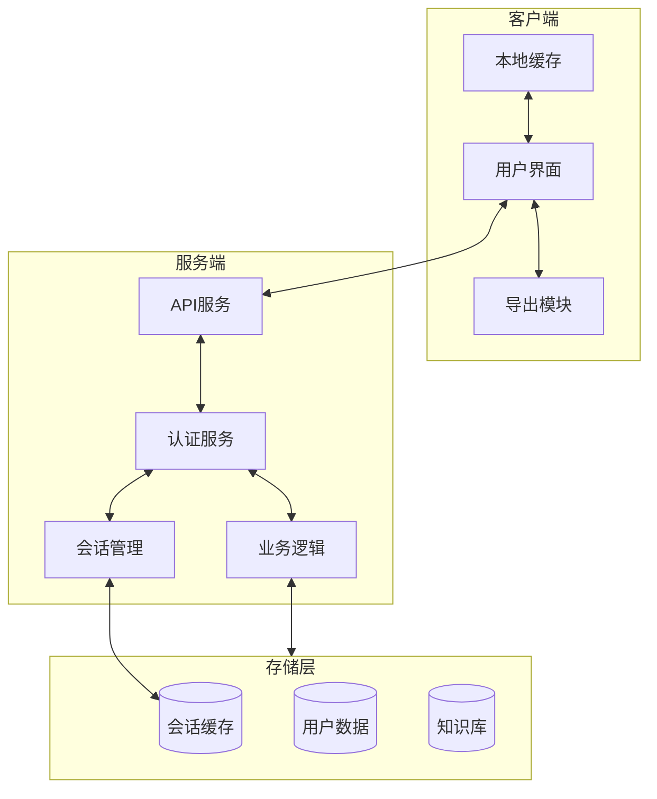
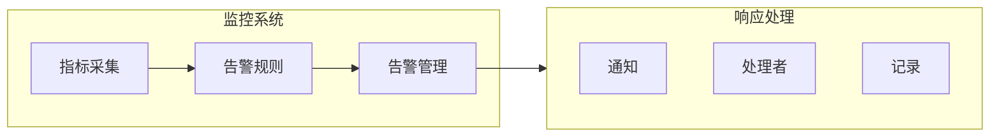

# 系统流程图

本文档使用Mermaid图形展示ScriptAI系统的各层级流程。

## 整体系统架构

```mermaid
flowchart TB
    User((用户)) --> Auth[认证系统]
    Auth --> WorkSpace[创作工作台]
    
    subgraph WorkSpace[创作工作台]
        Project[项目管理] --> Editor[剧本编辑器]
        Editor --> AIService[AI服务]
        Editor --> Export[本地导出]
    end
    
    subgraph Storage[存储层]
        Redis[(会话缓存)]
        PostgreSQL[(用户数据)]
        Milvus[(知识库)]
    end
    
    subgraph AIService[AI服务]
        RAG[RAG系统]
        Generator[生成服务]
        Validator[验证服务]
    end
    
    WorkSpace --> Storage
    AIService --> Storage
```

## 会话管理流程

```mermaid
sequenceDiagram
    participant U1 as 用户设备1
    participant U2 as 用户设备2
    participant A as 认证服务
    participant R as Redis会话存储
    
    Note over U1,A: 用户已在设备1登录
    
    U2->>A: 新的登录请求
    A->>R: 检查是否存在活跃会话
    R-->>A: 返回现有会话信息
    
    A->>R: 使旧会话token失效
    A->>U1: 发送WebSocket踢出通知
    Note over U1: 收到通知后自动登出
    
    A->>R: 创建新会话
    A->>U2: 返回新的token
    
    Note over U2: 登录成功
    Note over U1: 强制登出并提示
```

## RAG系统流程

```mermaid
flowchart LR
    Input[用户输入] --> Processor[文本处理器]
    
    subgraph VectorProcess[向量处理]
        Processor --> Embedding[文本向量化]
        Embedding --> VectorDB[(Milvus)]
        VectorDB --> Retriever[相关文档检索]
    end
    
    subgraph Generation[生成处理]
        Retriever --> Context[上下文组装]
        Context --> LLM[大语言模型]
        LLM --> Output[生成结果]
    end
    
    Output --> Validator[质量验证]
    Validator --> Final[最终输出]
```

## 剧本创作流程

```mermaid
stateDiagram-v2
    [*] --> ProjectCreation: 创建项目
    ProjectCreation --> StructureDesign: 架构设计
    StructureDesign --> CharacterDesign: 角色设计
    CharacterDesign --> StoryWriting: 剧情编写
    StoryWriting --> ClueDesign: 线索设计
    ClueDesign --> Export: 导出
    Export --> [*]
```

## 导出流程

```mermaid
flowchart TB
    subgraph ExportProcess[导出处理]
        Format[格式转换]
        Template[模板应用]
        Asset[资源打包]
        Quality[质量检查]
    end
    
    subgraph LocalSave[本地保存]
        File[文件生成]
        Download[下载保存]
    end
    
    ExportProcess --> LocalSave
```

## 数据流转图

```mermaid
flowchart TB
    subgraph Client[客户端]
        UI[用户界面]
        Cache[本地缓存]
        Export[导出模块]
    end
    
    subgraph Server[服务端]
        API[API服务]
        Auth[认证服务]
        Session[会话管理]
        Business[业务逻辑]
    end
    
    subgraph Storage[存储层]
        Redis[(会话缓存)]
        PostgreSQL[(用户数据)]
        Milvus[(知识库)]
    end
    
    UI <--> API
    API <--> Auth
    Auth <--> Session
    Session <--> Redis
    Auth <--> Business
    Business <--> Storage
    Cache <--> UI
    UI <--> Export
```

## 监控告警流程

```mermaid
flowchart LR
    subgraph Monitoring[监控系统]
        Metrics[指标采集]
        Rules[告警规则]
        Alert[告警管理]
    end
    
    subgraph Action[响应处理]
        Notification[通知]
        Handler[处理者]
        Record[记录]
    end
    
    Metrics --> Rules
    Rules --> Alert
    Alert --> Action
``` 