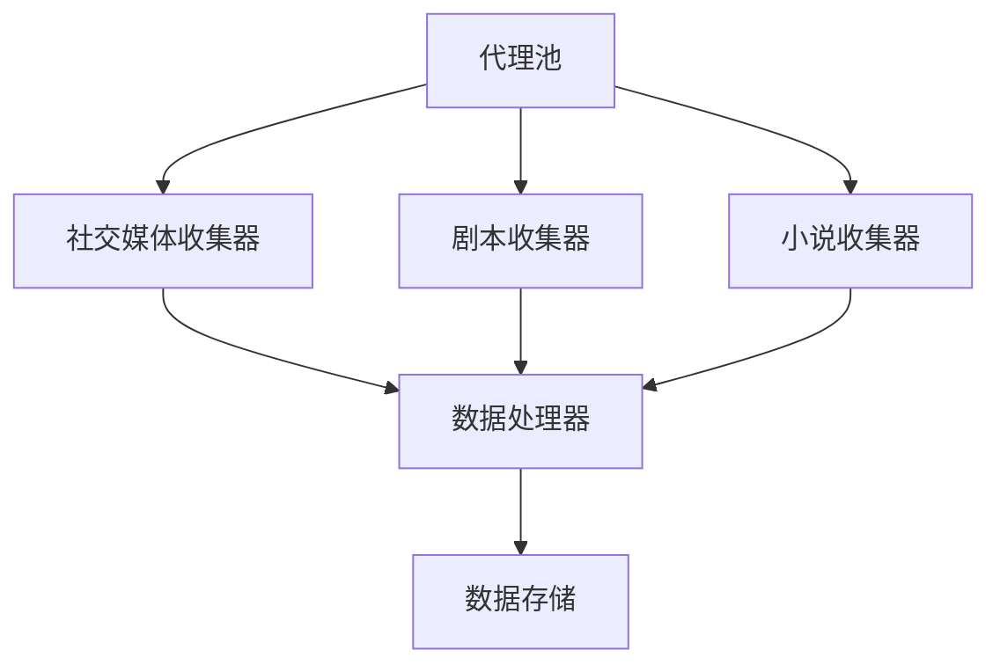

# 自动内容收集系统设计文档 v2.0

## 1. 项目概述

### 1.1 系统架构


### 1.2 核心功能模块
- 社交媒体热点发现
- 全网内容收集
- 智能去重纠错
- 分布式代理池
- 异步并发处理
- 数据存储与索引
- 监控告警系统

## 2. 详细设计

### 2.1 目录结构
```
project/
├── scripts/
│   ├── config/
│   │   ├── sources.py      # 数据源配置
│   │   ├── keywords.py     # 关键词配置
│   │   └── settings.py     # 全局配置
│   ├── collectors/
│   │   ├── base.py         # 基础收集器
│   │   ├── social/         # 社交媒体收集
│   │   │   ├── xiaohongshu.py
│   │   │   ├── douyin.py
│   │   │   └── bilibili.py
│   │   ├── script/         # 剧本收集
│   │   └── novel/          # 小说收集
│   ├── processors/
│   │   ├── cleaner.py      # 文本清洗
│   │   ├── deduplicator.py # 去重处理
│   │   └── validator.py    # 数据验证
│   ├── storage/
│   │   ├── elastic.py      # ES存储
│   │   └── file.py         # 文件存储
│   ├── utils/
│   │   ├── proxy_pool.py   # 代理池
│   │   ├── logger.py       # 日志工具
│   │   └── helpers.py      # 辅助函数
│   └── main.py
├── docs/
│   ├── scripts/
│   │   ├── emotional/      # 情感类剧本
│   │   ├── mystery/        # 悬疑类剧本
│   │   └── horror/         # 恐怖类剧本
│   ├── novels/
│   │   ├── emotional/      # 情感类小说
│   │   ├── adapted/        # 影视改编
│   │   └── original/       # 原创小说
│   ├── api/                # API文档
│   ├── dev/                # 开发文档
│   └── user/               # 用户手册
├── tests/                  # 测试用例
├── logs/                   # 日志文件
└── backup/                 # 数据备份
```

### 2.2 核心配置
```python
# scripts/config/settings.py
GLOBAL_SETTINGS = {
    # 并发配置
    'MAX_WORKERS': 10,
    'BATCH_SIZE': 100,
    
    # 代理配置
    'PROXY_POOL_SIZE': 50,
    'PROXY_CHECK_INTERVAL': 300,
    
    # 请求配置
    'TIMEOUT': 30,
    'RETRY_TIMES': 3,
    'RETRY_INTERVAL': 5,
    
    # 存储配置
    'STORAGE_TYPE': 'elasticsearch',
    'ES_HOSTS': ['localhost:9200'],
    
    # 日志配置
    'LOG_LEVEL': 'INFO',
    'LOG_FORMAT': '%(asctime)s - %(name)s - %(levelname)s - %(message)s'
}
```

### 2.3 异步社交媒体收集器
```python
# scripts/collectors/social/base.py
import aiohttp
import asyncio
from typing import List, Dict

class AsyncSocialCollector:
    def __init__(self):
        self.session = None
        self.proxy_pool = ProxyPool()
        
    async def init_session(self):
        self.session = aiohttp.ClientSession()
        
    async def close_session(self):
        if self.session:
            await self.session.close()
            
    async def fetch_with_retry(self, url: str, **kwargs) -> Dict:
        for _ in range(GLOBAL_SETTINGS['RETRY_TIMES']):
            try:
                proxy = await self.proxy_pool.get_proxy()
                async with self.session.get(url, proxy=proxy, **kwargs) as response:
                    return await response.json()
            except Exception as e:
                logger.error(f"Fetch error: {e}")
                await asyncio.sleep(GLOBAL_SETTINGS['RETRY_INTERVAL'])
        return None

    async def collect_batch(self, urls: List[str]) -> List[Dict]:
        tasks = [self.fetch_with_retry(url) for url in urls]
        return await asyncio.gather(*tasks)
```

### 2.4 增强版代理池
```python
# scripts/utils/proxy_pool.py
from typing import Optional
import aiohttp
import asyncio
import time

class EnhancedProxyPool:
    def __init__(self):
        self.proxies = {}  # proxy -> score mapping
        self.lock = asyncio.Lock()
        self.min_score = 0.3
        
    async def add_proxy(self, proxy: str, score: float = 1.0):
        async with self.lock:
            self.proxies[proxy] = score
            
    async def remove_proxy(self, proxy: str):
        async with self.lock:
            self.proxies.pop(proxy, None)
            
    async def update_score(self, proxy: str, success: bool):
        async with self.lock:
            if proxy in self.proxies:
                if success:
                    self.proxies[proxy] = min(1.0, self.proxies[proxy] + 0.1)
                else:
                    self.proxies[proxy] = max(0.0, self.proxies[proxy] - 0.2)
                    if self.proxies[proxy] < self.min_score:
                        await self.remove_proxy(proxy)
                        
    async def get_proxy(self) -> Optional[str]:
        async with self.lock:
            if not self.proxies:
                return None
            return max(self.proxies.items(), key=lambda x: x[1])[0]
```

### 2.5 智能去重系统
```python
# scripts/processors/deduplicator.py
from typing import List, Dict
import hashlib
from difflib import SequenceMatcher

class SmartDeduplicator:
    def __init__(self):
        self.content_hashes = set()
        self.title_similarity_threshold = 0.85
        
    def compute_hash(self, content: str) -> str:
        return hashlib.md5(content.encode()).hexdigest()
        
    def compute_similarity(self, text1: str, text2: str) -> float:
        return SequenceMatcher(None, text1, text2).ratio()
        
    def is_duplicate(self, item: Dict) -> bool:
        # 检查内容哈希
        content_hash = self.compute_hash(item['content'])
        if content_hash in self.content_hashes:
            return True
            
        # 检查标题相似度
        for existing_title in self.existing_titles:
            if self.compute_similarity(item['title'], existing_title) > self.title_similarity_threshold:
                return True
                
        return False
        
    def add_item(self, item: Dict):
        self.content_hashes.add(self.compute_hash(item['content']))
        self.existing_titles.add(item['title'])
```

## 3. 部署与运维

### 3.1 环境准备
```bash
# 安装依赖
pip install -r requirements.txt

# 创建必要目录
mkdir -p docs/{scripts,novels}/{emotional,mystery,horror}
mkdir -p logs backup
```

### 3.2 监控与告警
```python
# scripts/utils/monitor.py
import prometheus_client
from prometheus_client import Counter, Gauge, Histogram

class CollectorMetrics:
    def __init__(self):
        self.requests_total = Counter(
            'collector_requests_total',
            'Total number of requests made',
            ['collector_type', 'status']
        )
        
        self.proxy_pool_size = Gauge(
            'proxy_pool_size',
            'Current size of proxy pool'
        )
        
        self.request_duration = Histogram(
            'request_duration_seconds',
            'Request duration in seconds',
            ['collector_type']
        )
```

## 4. 测试规范

### 4.1 单元测试
```python
# tests/test_collectors.py
import pytest
import asyncio
from scripts.collectors.social.xiaohongshu import XiaohongshuCollector

@pytest.mark.asyncio
async def test_xiaohongshu_collector():
    collector = XiaohongshuCollector()
    await collector.init_session()
    
    results = await collector.search_hot_topics('剧本杀')
    assert len(results) > 0
    assert all('title' in item for item in results)
    
    await collector.close_session()
```

### 4.2 集成测试
```python
# tests/test_integration.py
import pytest
from scripts.main import ContentCollector

def test_full_collection_flow():
    collector = ContentCollector()
    
    # 测试社交媒体热点发现
    hot_topics = collector.discover_hot_topics()
    assert len(hot_topics) > 0
    
    # 测试内容收集
    content = collector.collect_content(hot_topics[0])
    assert content is not None
    
    # 测试去重
    duplicate = collector.collect_content(hot_topics[0])
    assert collector.deduplicator.is_duplicate(duplicate)
```

## 5. 错误处理与日志

### 5.1 统一错误处理
```python
# scripts/utils/exceptions.py
class CollectorException(Exception):
    def __init__(self, message: str, collector_type: str, url: str):
        self.message = message
        self.collector_type = collector_type
        self.url = url
        super().__init__(self.message)

# scripts/utils/error_handler.py
class ErrorHandler:
    @staticmethod
    async def handle_request_error(e: Exception, context: Dict):
        logger.error(f"Request error: {e}", extra=context)
        metrics.requests_total.labels(
            collector_type=context['collector_type'],
            status='error'
        ).inc()
```

### 5.2 结构化日志
```python
# scripts/utils/logger.py
import logging
import json
from typing import Dict

class StructuredLogger:
    def __init__(self):
        self.logger = logging.getLogger('collector')
        self.setup_handlers()
        
    def log(self, level: str, message: str, context: Dict = None):
        if context is None:
            context = {}
            
        log_entry = {
            'message': message,
            'context': context,
            'timestamp': time.time()
        }
        
        getattr(self.logger, level)(json.dumps(log_entry))
```

## 6. 性能优化

### 6.1 异步并发
- 使用 asyncio 实现异步请求
- 使用线程池处理CPU密集任务
- 实现请求限流器

### 6.2 缓存策略
- 使用 Redis 缓存热点数据
- 实现多级缓存机制
- 定期清理过期缓存

## 7. 数据备份

### 7.1 备份策略
- 每日增量备份
- 每周全量备份
- 多副本存储

### 7.2 数据恢复
- 支持按时间点恢复
- 支持选择性恢复
- 自动恢复验证