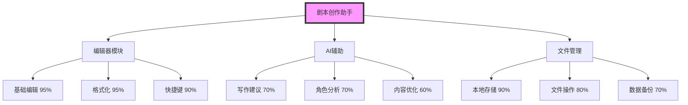
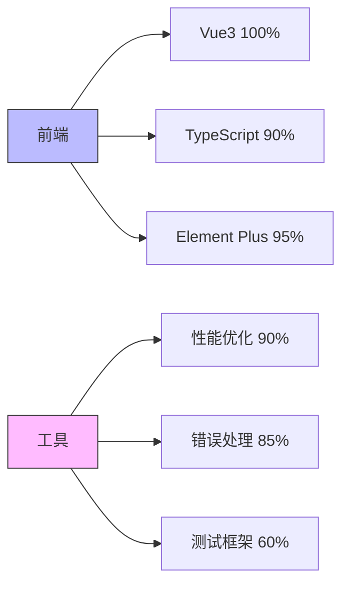
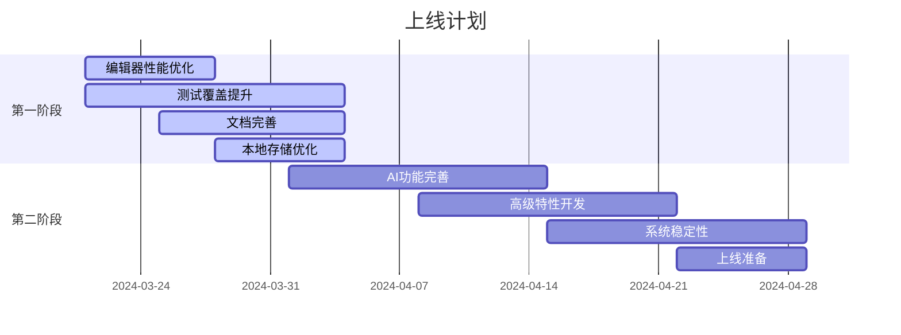
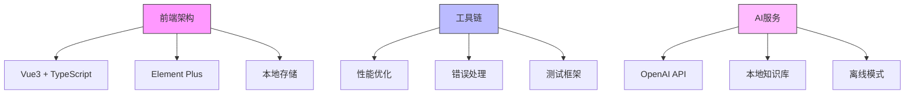

# 剧本创作助手产品地图

## 一、项目进度总览 (80%)

### 1. 核心功能 (85%)


### 2. 技术实现 (85%)


## 二、功能模块树
```
剧本创作助手 (80%)
├── 编辑器模块 (85%)
│   ├── 基础编辑功能 (95%)
│   │   ├── 文本编辑器 (100%)
│   │   ├── 虚拟滚动 (90%)
│   │   ├── 撤销/重做 (100%)
│   │   └── 自动保存 (90%)
│   ├── 格式化工具 (95%)
│   │   ├── 缩进配置 (100%)
│   │   ├── 大小写配置 (100%)
│   │   ├── 宽度配置 (90%)
│   │   └── 行距配置 (90%)
│   ├── 工具栏功能 (85%)
│   │   ├── 场景管理 (90%)
│   │   ├── 角色管理 (90%)
│   │   ├── 对话管理 (80%)
│   │   └── 转场管理 (80%)
│   ├── 快捷键系统 (90%)
│   │   ├── 快捷键配置 (95%)
│   │   ├── 快捷键帮助 (100%)
│   │   └── 快捷键冲突检测 (75%)
│   └── 性能优化 (70%)
│       ├── 防抖节流 (100%)
│       ├── 批处理 (90%)
│       └── 缓存管理 (80%)
├── AI辅助功能 (70%)
│   ├── 写作建议 (70%)
│   │   ├── 情节建议 (70%)
│   │   ├── 对话优化 (70%)
│   │   └── 风格分析 (60%)
│   ├── 角色分析 (70%)
│   │   ├── 角色设计 (80%)
│   │   ├── 性格分析 (70%)
│   │   └── 关系网络 (60%)
│   └── 内容优化 (60%)
│       ├── 文本润色 (70%)
│       ├── 逻辑检查 (60%)
│       └── 完整性验证 (50%)
├── 文件管理 (80%)
│   ├── 本地存储 (90%)
│   │   ├── IndexedDB (95%)
│   │   ├── LocalStorage (100%)
│   │   └── 文件系统 (75%)
│   ├── 文件操作 (80%)
│   │   ├── 导入导出 (85%)
│   │   ├── 格式转换 (75%)
│   │   └── 批量处理 (70%)
│   └── 数据备份 (70%)
│       ├── 自动备份 (80%)
│       ├── 版本管理 (60%)
│       └── 恢复功能 (70%)
└── 系统功能 (85%)
    ├── 用户管理 (90%)
    │   ├── 账号系统 (95%)
    │   ├── 个人资料 (90%)
    │   └── 用户设置 (85%)
    ├── 错误处理 (85%)
    │   ├── 错误捕获 (90%)
    │   ├── 错误恢复 (80%)
    │   └── 错误日志 (85%)
    └── 性能优化 (90%)
        ├── 加载优化 (95%)
        ├── 运行优化 (90%)
        └── 存储优化 (85%)
```

## 三、开发时间线


## 四、任务优先级

### P0 - 必须完成（2周内）
- 编辑器性能优化 -> 90%
- E2E测试覆盖 -> 60%
- 用户指南完善 -> 80%
- 错误处理完善 -> 90%
- 备份机制完善 -> 85%

### P1 - 重要（4周内）
- AI功能稳定性 -> 85%
- 实时预览优化 -> 90%
- 性能监控系统 -> 80%
- 数据恢复机制 -> 90%
- 文档系统完善 -> 85%

### P2 - 待办（上线后）
- 本地知识库 -> 70%
- 协同编辑基础 -> 60%
- 版本管理系统 -> 70%
- 离线模式支持 -> 60%

## 五、上线检查项

### 1. 核心功能 (必检)
- [ ] 编辑器基础功能
- [ ] 格式化工具
- [ ] 快捷键系统
- [ ] 本地存储
- [ ] 文件导出

### 2. 性能指标 (必检)
- [ ] 编辑器响应时间 < 100ms
- [ ] 文件加载时间 < 1s
- [ ] 内存占用 < 500MB
- [ ] AI响应时间 < 2s

### 3. 稳定性指标 (必检)
- [ ] 崩溃率 < 0.1%
- [ ] 错误率 < 1%
- [ ] 数据丢失率 0%
- [ ] 备份成功率 100%

### 4. 文档完备性 (必检)
- [ ] 用户手册
- [ ] 安装指南
- [ ] API文档
- [ ] 常见问题
- [ ] 错误码说明

### 5. 运维准备 (必检)
- [ ] 监控系统
- [ ] 报警规则
- [ ] 备份方案
- [ ] 应急预案
- [ ] 更新机制

## 六、待开发功能

### 短期计划 (1-2周)
- 编辑器性能优化
- 本地存储增强
- 文件备份机制
- 测试覆盖提升

### 中期计划 (2-4周)
- AI功能扩展
- 导出格式增加
- 文档系统完善
- 用户体验优化

### 长期计划 (1-2月)
- 完整测试体系
- 性能监控系统
- 用户反馈收集
- 产品迭代优化

## 七、技术架构


## 八、测试覆盖 (60%)
- 单元测试 (70%)
- API测试 (60%)
- 集成测试 (60%)
- E2E测试 (20%)
- 性能测试 (50%)

## 九、文档完善 (75%)
- 架构文档 (90%)
- API文档 (80%)
- 开发日志 (80%)
- 用户指南 (60%)
- 部署文档 (70%)
- 贡献指南 (50%) 