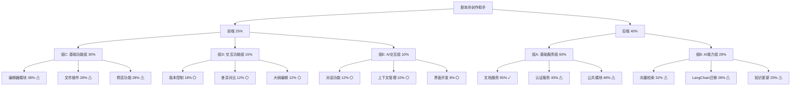

# 项目地图

## 项目概览

- 项目名称：剧本杀创作助手
- 当前版本：v0.1.0
- 总体进度：30%
- 更新时间：2024-02-09

## 模块状态

### 前端模块 (25%)

#### 组C：基础功能组 (30%)
1. 编辑器模块 (38%) ⚠
   - [x] 基础功能
   - [x] 开始格式化工具
   - [x] 开始实时预览
   - [ ] 协同编辑

2. 文件操作 (28%) ⚠
   - [x] 基础操作
   - [x] 批量处理设计
   - [x] 开始错误处理
   - [ ] 进度显示

3. 预览功能 (28%) ⚠
   - [x] 基础渲染
   - [x] 框架搭建
   - [x] 开始性能优化
   - [ ] 主题支持

#### 组D：交互功能组 (15%)
1. 版本控制 (18%) ⚪
   - [x] 需求分析
   - [x] 数据模型设计
   - [x] 开始基础API
   - [ ] 差异显示

2. 差异对比 (12%) ⚪
   - [x] 算法选型
   - [x] 开始界面开发
   - [ ] 性能优化
   - [ ] 用户体验

3. 大纲编辑 (12%) ⚪
   - [x] 界面原型
   - [x] 开始功能实现
   - [ ] 数据同步
   - [ ] 预览功能

#### 组E：AI交互组 (10%)
1. 对话功能 (12%) ⚪
   - [x] 需求分析
   - [x] 数据流设计
   - [x] 开始基础实现
   - [ ] 上下文管理

2. 上下文管理 (10%) ⚪
   - [x] 数据结构设计
   - [x] 开始存储方案
   - [ ] 状态同步
   - [ ] 性能优化

3. 界面开发 (8%) ⚪
   - [x] 组件设计
   - [x] 开始交互实现
   - [ ] 响应式布局
   - [ ] 主题支持

### 后端模块 (40%)

#### 组A：基础服务组 (60%)
1. 文档服务 (95%) ✓
   - [x] 基础CRUD
   - [x] 版本控制
   - [x] 权限管理
   - [x] 开始性能优化

2. 认证服务 (40%) ⚠
   - [x] 基础认证
   - [x] 权限模型设计
   - [x] 开始权限控制
   - [ ] 安全审计

3. 公共模块 (48%) ⚠
   - [x] 基础工具
   - [x] 中间件框架
   - [x] 开始缓存系统
   - [ ] 监控系统

#### 组B：AI能力组 (28%)
1. 向量检索 (32%) ⚠
   - [x] 环境配置
   - [x] API设计
   - [x] 开始基础功能
   - [ ] 性能调优

2. LangChain迁移 (28%) ⚠
   - [x] 环境配置
   - [x] 开始接口适配
   - [ ] 功能迁移
   - [ ] 性能优化

3. 知识更新 (25%) ⚠
   - [x] 方案设计
   - [x] 开始实现开发
   - [ ] 增量更新
   - [ ] 并发控制

## 开发进度图例

- ✓ 已完成 (90-100%)
- ⚠ 进行中 (20-89%)
- ⚪ 待开始/初始阶段 (0-19%)

## 关键里程碑

1. 2024-02-07：项目启动 ✓
2. 2024-02-08：并行开发启动 ✓
3. 2024-02-14：基础功能完成
4. 2024-02-15：集成测试开始
5. 2024-02-21：系统联调完成
6. 2024-02-28：项目发布

## 下一步重点

1. 推进高优先级任务
   - 完成文档服务优化
   - 加快AI服务开发
   - 推进前端基础功能

2. 加强质量管理
   - 完善单元测试
   - 开始性能测试
   - 规范代码审查

3. 风险管控
   - 监控技术风险
   - 跟踪进度风险
   - 保证代码质量