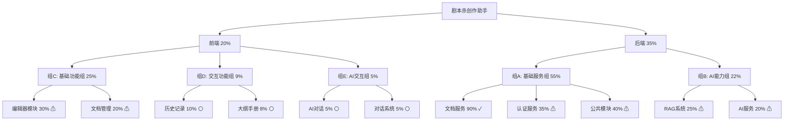

# 项目地图

## 项目概览

- 项目名称：剧本杀创作助手
- 当前版本：v0.1.0
- 总体进度：30%
- 更新时间：2024-02-16

## 模块状态

### 前端模块 (20%)

#### 组C：基础功能组 (25%)
1. 编辑器模块 (30%) ⚠
   - [x] 基础布局
   - [ ] 格式化工具
   - [ ] 实时预览
   - [ ] 协同编辑

2. 文档管理 (20%) ⚠
   - [x] 基础列表
   - [ ] 文件操作
   - [ ] 目录结构
   - [ ] 搜索功能

#### 组D：交互功能组 (9%)
1. 历史记录 (10%) ⚪
   - [x] 基础记录
   - [ ] 版本记录
   - [ ] 差异对比
   - [ ] 回滚功能

2. 大纲手册 (8%) ⚪
   - [ ] 大纲编辑
   - [ ] 导出功能
   - [ ] 预览系统

#### 组E：AI交互组 (5%)
1. AI对话 (5%) ⚪
   - [x] 基础界面
   - [ ] 上下文管理
   - [ ] 知识检索

2. 对话系统 (5%) ⚪
   - [ ] 界面设计
   - [ ] 编辑器集成
   - [ ] 消息处理

### 后端模块 (35%)

#### 组A：基础服务组 (55%)
1. 文档服务 (90%) ✓
   - [x] 基础CRUD
   - [x] 版本控制
   - [x] 单元测试
   - [ ] 性能优化

2. 认证服务 (35%) ⚠
   - [x] 基础认证
   - [ ] 权限控制
   - [ ] 安全审计
   - [ ] 会话管理

3. 公共模块 (40%) ⚠
   - [x] 基础工具
   - [ ] 中间件
   - [ ] 缓存系统

#### 组B：AI能力组 (22%)
1. RAG系统 (25%) ⚠
   - [x] 基础架构
   - [ ] 向量检索
   - [ ] 知识更新
   - [ ] 性能优化

2. AI服务 (20%) ⚠
   - [x] API集成
   - [ ] 上下文管理
   - [ ] 知识库集成
   - [ ] 响应优化

## 开发进度图例

- ✓ 已完成 (90-100%)
- ⚠ 进行中 (20-89%)
- ⚪ 待开始/初始阶段 (0-19%)

## 关键里程碑

1. 2024-03-01：基础功能组完成
2. 2024-03-15：AI能力组完成
3. 2024-03-29：AI交互组完成
4. 2024-04-06：系统集成完成
5. 2024-04-30：项目发布

## 下一步重点

1. 组A和组C并行开发
   - 文档服务优化
   - 编辑器核心功能
   - 认证系统完善
   - 文档管理系统

2. 准备组B和组D启动
   - RAG系统开发准备
   - AI服务集成规划
   - 历史记录系统设计
   - 大纲手册功能规划

3. 质量保证
   - 单元测试覆盖
   - 接口文档完善
   - 性能优化
   - 代码审查