# 项目结构图 [15%]

```mermaid
graph TB
    JuBenSha[剧本杀创作助手 15%]
    
    %% 前端部分
    JuBenSha --> Frontend[前端 15%]
    Frontend --> FE_Base[基础设施 60%]
    Frontend --> FE_Core[核心功能 10%]
    Frontend --> FE_Test[测试系统 5%]
    
    %% 前端基础设施
    FE_Base --> FE_Base1[Vue3框架 ✓]
    FE_Base --> FE_Base2[TypeScript ✓]
    FE_Base --> FE_Base3[Element Plus ⚠]
    FE_Base --> FE_Base4[状态管理 ⚠]
    FE_Base --> FE_Base5[路由系统 ⚠]
    FE_Base --> FE_Base6[样式系统 ⚪]
    
    %% 前端核心功能
    FE_Core --> Editor[编辑器模块 20%]
    Editor --> Editor1[基础编辑 ⚠]
    Editor --> Editor2[格式化工具 ⚪]
    Editor --> Editor3[实时预览 ⚪]
    Editor --> Editor4[协同编辑 ⚪]
    
    FE_Core --> Document[文档管理 10%]
    Document --> Doc1[文件操作 ⚠]
    Document --> Doc2[目录结构 ⚠]
    Document --> Doc3[搜索功能 ⚪]
    Document --> Doc4[权限管理 ⚪]
    
    FE_Core --> History[历史记录 5%]
    History --> His1[版本记录 ⚠]
    History --> His2[差异对比 ⚪]
    History --> His3[回滚功能 ⚪]
    
    FE_Core --> Outline[大纲手册 5%]
    Outline --> Out1[大纲编辑 ⚠]
    Outline --> Out2[导出功能 ⚪]
    Outline --> Out3[预览功能 ⚪]
    
    FE_Core --> AIChat[AI对话 0%]
    AIChat --> AI1[基础对话 ⚪]
    AIChat --> AI2[上下文管理 ⚪]
    AIChat --> AI3[知识检索 ⚪]
    
    FE_Core --> Dialogue[对话系统 0%]
    Dialogue --> Dia1[界面设计 ⚪]
    Dialogue --> Dia2[消息处理 ⚪]
    Dialogue --> Dia3[编辑集成 ⚪]
    
    %% 后端部分
    JuBenSha --> Backend[后端 15%]
    Backend --> BE_Base[基础设施 70%]
    Backend --> BE_Core[核心功能 10%]
    Backend --> BE_Test[测试系统 5%]
    
    %% 后端基础设施
    BE_Base --> BE_Base1[Express框架 ✓]
    BE_Base --> BE_Base2[TypeScript ✓]
    BE_Base --> BE_Base3[数据库集成 ⚠]
    BE_Base --> BE_Base4[中间件系统 ⚠]
    BE_Base --> BE_Base5[路由系统 ⚠]
    BE_Base --> BE_Base6[缓存系统 ⚪]
    
    %% 后端核心功能
    BE_Core --> DocService[文档服务 15%]
    DocService --> DS1[CRUD接口 ⚠]
    DocService --> DS2[版本控制 ⚪]
    DocService --> DS3[协同功能 ⚪]
    
    BE_Core --> RAGService[RAG系统 10%]
    RAGService --> RAG1[知识库结构 ⚠]
    RAGService --> RAG2[向量检索 ⚪]
    RAGService --> RAG3[知识更新 ⚪]
    
    BE_Core --> AIService[AI服务 5%]
    AIService --> AIS1[基础调用 ⚠]
    AIService --> AIS2[上下文管理 ⚪]
    AIService --> AIS3[知识集成 ⚪]
    
    BE_Core --> AuthService[认证服务 25%]
    AuthService --> Auth1[用户认证 ⚠]
    AuthService --> Auth2[权限控制 ⚠]
    AuthService --> Auth3[安全审计 ⚪]
    
    BE_Core --> Common[公共模块 30%]
    Common --> Com1[配置管理 ✓]
    Common --> Com2[日志系统 ⚠]
    Common --> Com3[中间件 ⚠]
    Common --> Com4[工具函数 ⚪]
    
    %% 测试系统
    FE_Test --> FE_Test1[单元测试 5%]
    FE_Test --> FE_Test2[集成测试 5%]
    FE_Test --> FE_Test3[E2E测试 ⚪]
    
    BE_Test --> BE_Test1[单元测试 10%]
    BE_Test --> BE_Test2[集成测试 5%]
    BE_Test --> BE_Test3[性能测试 ⚪]
    
    %% 样式定义
    classDef default fill:#f9f9f9,stroke:#333,stroke-width:2px;
    classDef done fill:#d4edda,stroke:#28a745,stroke-width:2px;
    classDef inProgress fill:#fff3cd,stroke:#ffc107,stroke-width:2px;
    classDef notStarted fill:#f8d7da,stroke:#dc3545,stroke-width:2px;
    
    %% 应用样式
    class JuBenSha,Frontend,Backend default;
    class FE_Base,BE_Base done;
    class Editor,Document,DocService,Common inProgress;
    class AIChat,Dialogue,AIService,RAGService notStarted;
```

## 图例说明
- ✓ 已完成 (100%)
- ⚠ 进行中 (1-99%)
- ⚪ 未开始 (0%)

## 颜色说明
- 🟩 绿色: 已完成模块 (>75%)
- 🟨 黄色: 进行中模块 (25-75%)
- 🟥 红色: 待开始/初期模块 (<25%)
- ⬜ 灰色: 父级模块/分类

## 模块依赖关系
1. 前端模块依赖：
   - 编辑器 → 文档管理
   - 历史记录 → 文档管理
   - 大纲手册 → 文档管理
   - AI对话 → 文档管理
   - 对话系统 → 编辑器

2. 后端模块依赖：
   - 文档服务 → 公共模块
   - RAG系统 → 公共模块
   - AI服务 → RAG系统 → 公共模块
   - 认证服务 → 公共模块