# 剧本杀游戏平台系统架构

## 一、系统架构图

### 1.1 整体架构
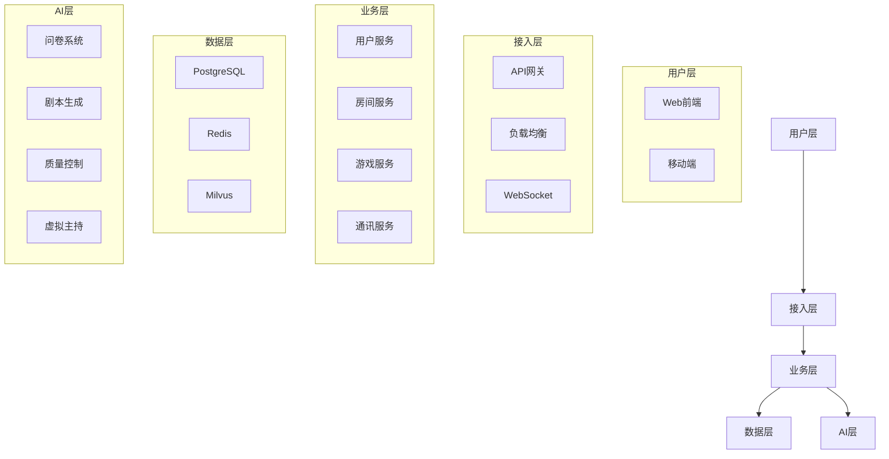

### 1.2 业务流程图
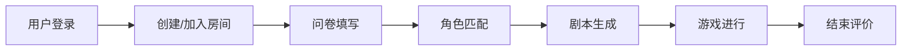

## 二、功能模块图

### 2.1 AI引擎模块
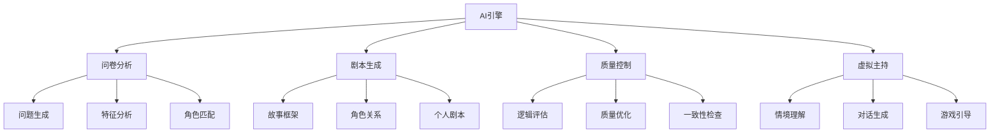

### 2.2 实时通讯模块
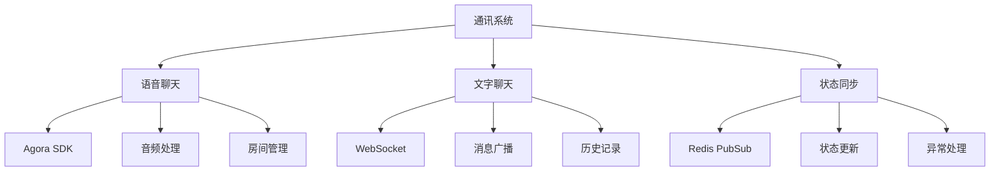

### 2.3 内容采集系统
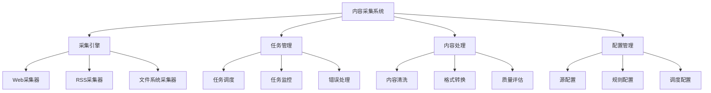

### 2.4 采集流程图
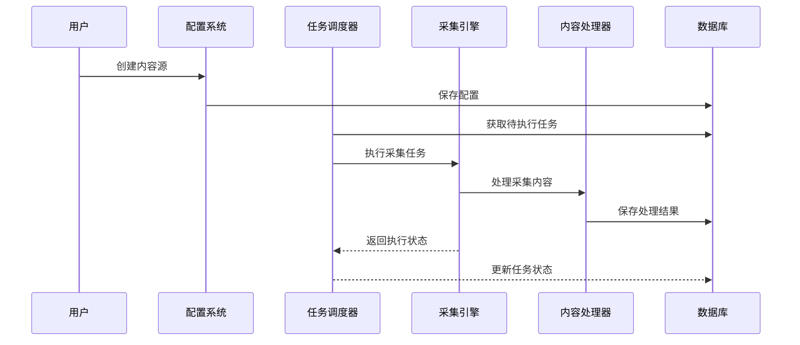

### 2.5 数据流向图
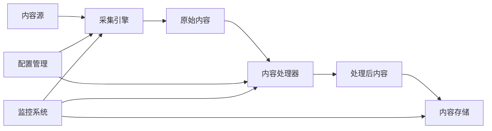

## 三、数据流向图

### 3.1 问卷流程
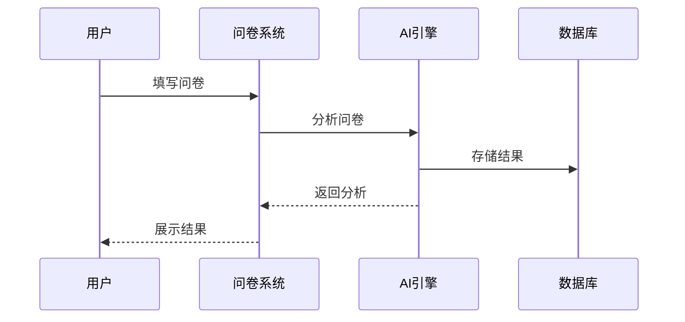

### 3.2 剧本生成流程
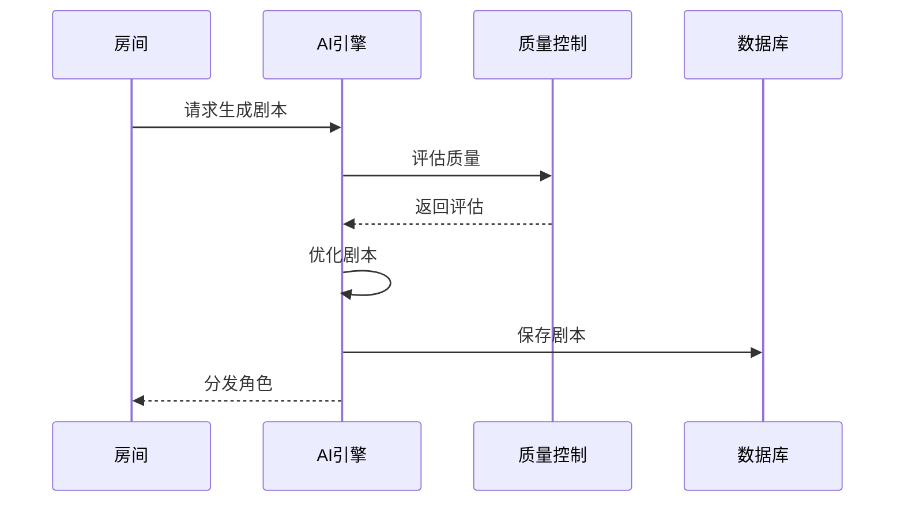

## 四、部署架构图

### 4.1 服务器架构
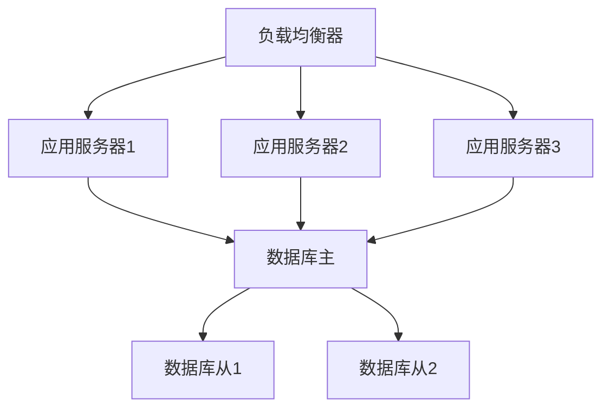

### 4.2 缓存架构
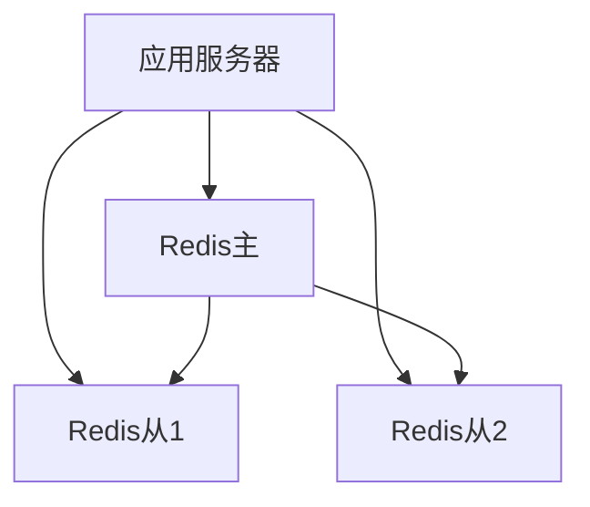

## 五、监控架构图

### 5.1 系统监控
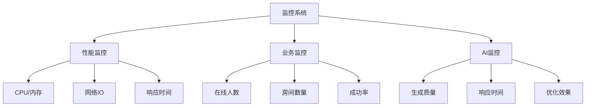

### 5.2 告警系统
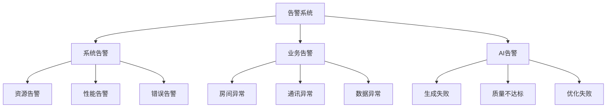

## 六、安全架构图

### 6.1 安全防护
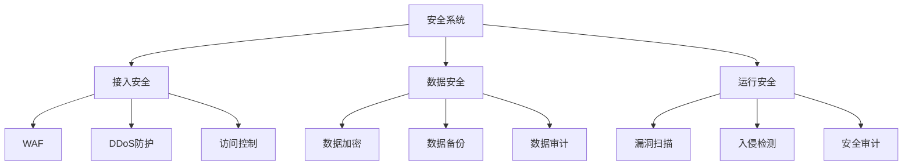
