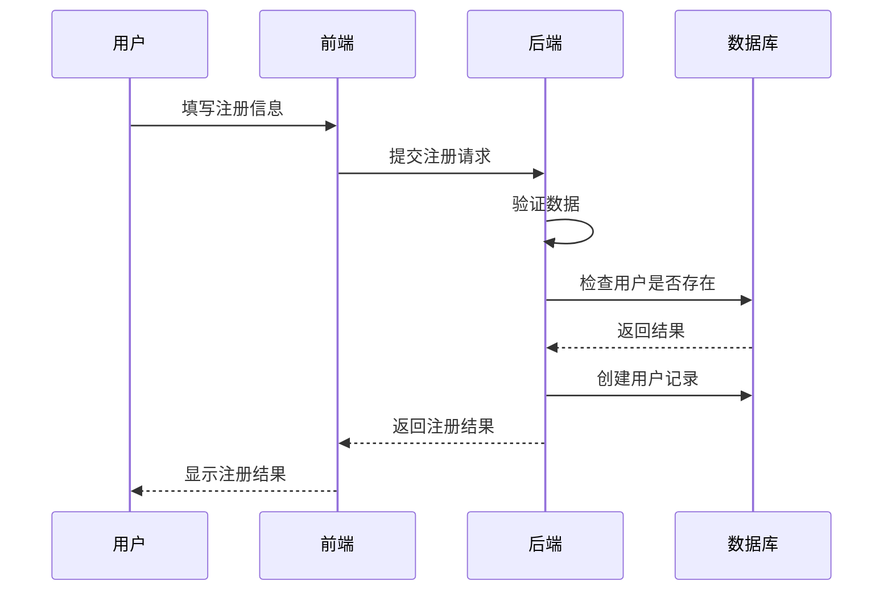
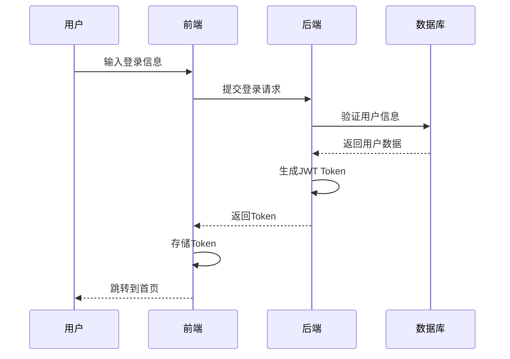
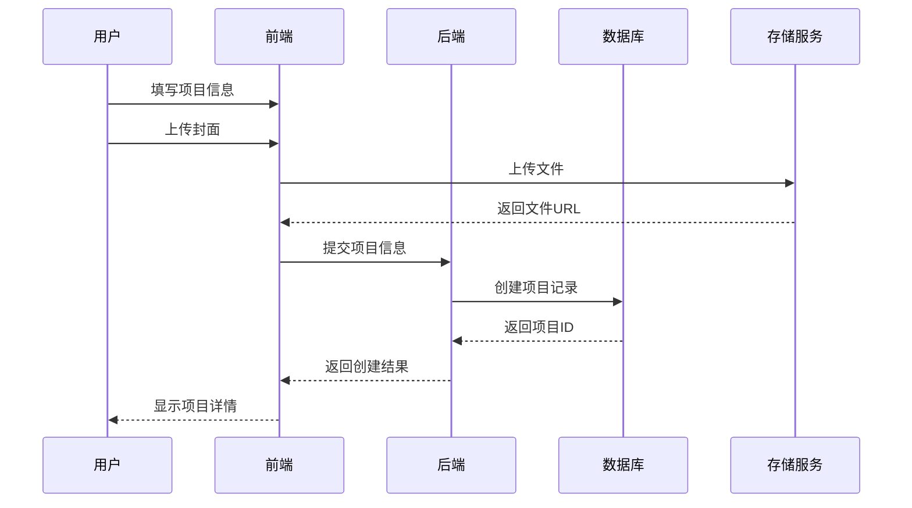
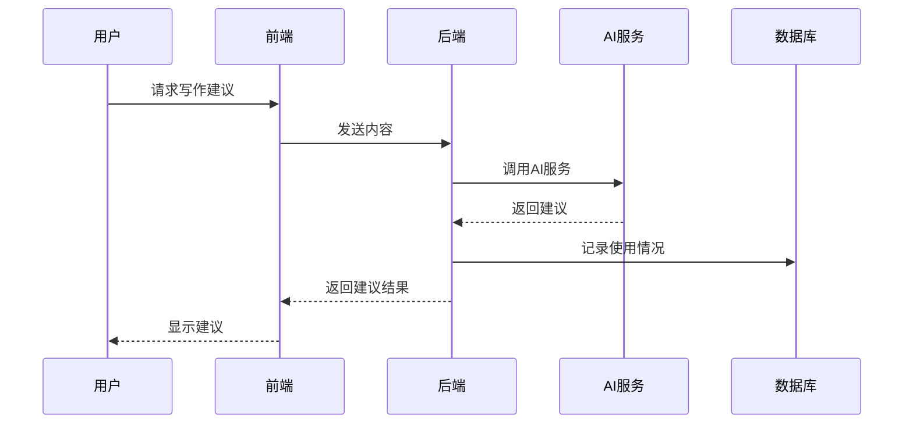
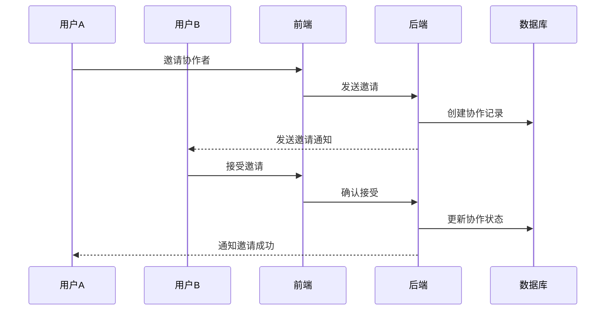
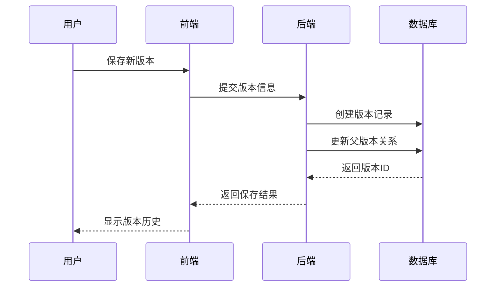
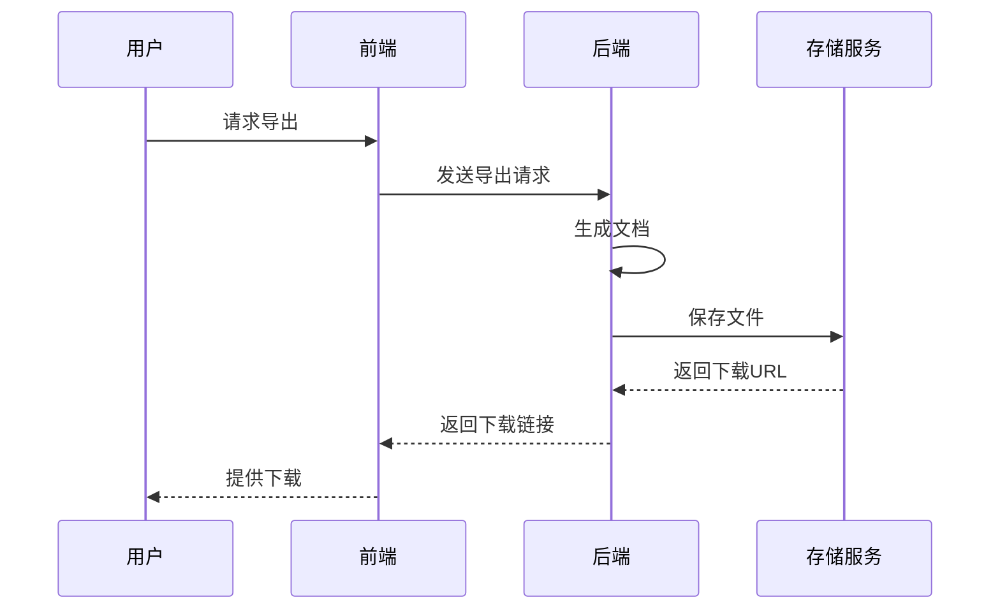
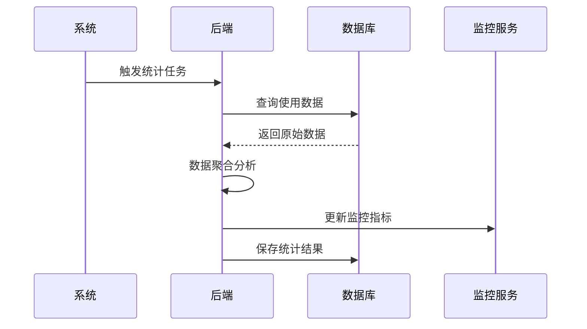
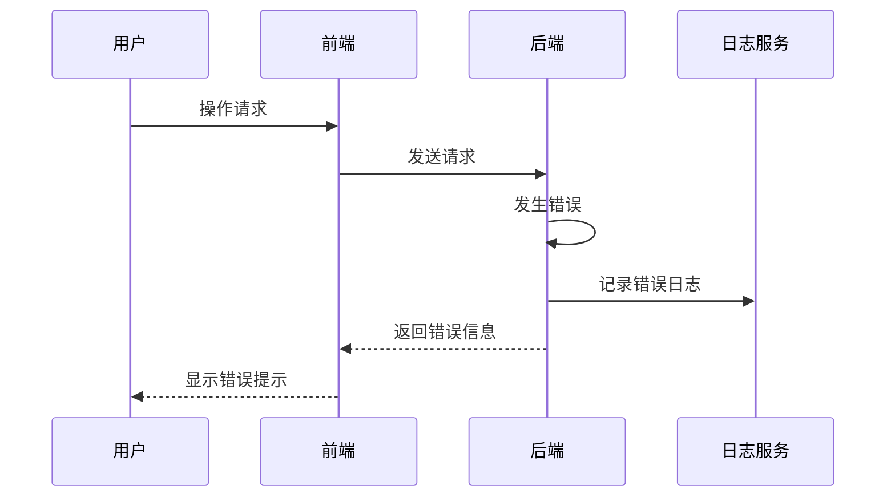

# 业务流程文档

## 用户注册流程

```mermaid
sequenceDiagram
    participant U as 用户
    participant F as 前端
    participant B as 后端
    participant DB as 数据库

    U->>F: 填写注册信息
    F->>B: 提交注册请求
    B->>B: 验证数据
    B->>DB: 检查用户是否存在
    DB-->>B: 返回结果
    B->>DB: 创建用户记录
    B-->>F: 返回注册结果
    F-->>U: 显示注册结果
```

## 用户登录流程

```mermaid
sequenceDiagram
    participant U as 用户
    participant F as 前端
    participant B as 后端
    participant DB as 数据库

    U->>F: 输入登录信息
    F->>B: 提交登录请求
    B->>DB: 验证用户信息
    DB-->>B: 返回用户数据
    B->>B: 生成JWT Token
    B-->>F: 返回Token
    F->>F: 存储Token
    F-->>U: 跳转到首页
```

## 项目创建流程

```mermaid
sequenceDiagram
    participant U as 用户
    participant F as 前端
    participant B as 后端
    participant DB as 数据库
    participant S as 存储服务

    U->>F: 填写项目信息
    U->>F: 上传封面
    F->>S: 上传文件
    S-->>F: 返回文件URL
    F->>B: 提交项目信息
    B->>DB: 创建项目记录
    DB-->>B: 返回项目ID
    B-->>F: 返回创建结果
    F-->>U: 显示项目详情
```

## AI写作建议流程

```mermaid
sequenceDiagram
    participant U as 用户
    participant F as 前端
    participant B as 后端
    participant AI as AI服务
    participant DB as 数据库

    U->>F: 请求写作建议
    F->>B: 发送内容
    B->>AI: 调用AI服务
    AI-->>B: 返回建议
    B->>DB: 记录使用情况
    B-->>F: 返回建议结果
    F-->>U: 显示建议
```

## 项目协作流程

```mermaid
sequenceDiagram
    participant U1 as 用户A
    participant U2 as 用户B
    participant F as 前端
    participant B as 后端
    participant DB as 数据库

    U1->>F: 邀请协作者
    F->>B: 发送邀请
    B->>DB: 创建协作记录
    B-->>U2: 发送邀请通知
    U2->>F: 接受邀请
    F->>B: 确认接受
    B->>DB: 更新协作状态
    B-->>U1: 通知邀请成功
```

## 版本控制流程

```mermaid
sequenceDiagram
    participant U as 用户
    participant F as 前端
    participant B as 后端
    participant DB as 数据库

    U->>F: 保存新版本
    F->>B: 提交版本信息
    B->>DB: 创建版本记录
    B->>DB: 更新父版本关系
    DB-->>B: 返回版本ID
    B-->>F: 返回保存结果
    F-->>U: 显示版本历史
```

## 导出发布流程

```mermaid
sequenceDiagram
    participant U as 用户
    participant F as 前端
    participant B as 后端
    participant S as 存储服务

    U->>F: 请求导出
    F->>B: 发送导出请求
    B->>B: 生成文档
    B->>S: 保存文件
    S-->>B: 返回下载URL
    B-->>F: 返回下载链接
    F-->>U: 提供下载
```

## 数据统计流程

```mermaid
sequenceDiagram
    participant S as 系统
    participant B as 后端
    participant DB as 数据库
    participant M as 监控服务

    S->>B: 触发统计任务
    B->>DB: 查询使用数据
    DB-->>B: 返回原始数据
    B->>B: 数据聚合分析
    B->>M: 更新监控指标
    B->>DB: 保存统计结果
```

## 错误处理流程

```mermaid
sequenceDiagram
    participant U as 用户
    participant F as 前端
    participant B as 后端
    participant L as 日志服务

    U->>F: 操作请求
    F->>B: 发送请求
    B->>B: 发生错误
    B->>L: 记录错误日志
    B-->>F: 返回错误信息
    F-->>U: 显示错误提示
``` 