# 剧本杀游戏平台项目地图

## 一、系统架构图

### 1.1 整体架构
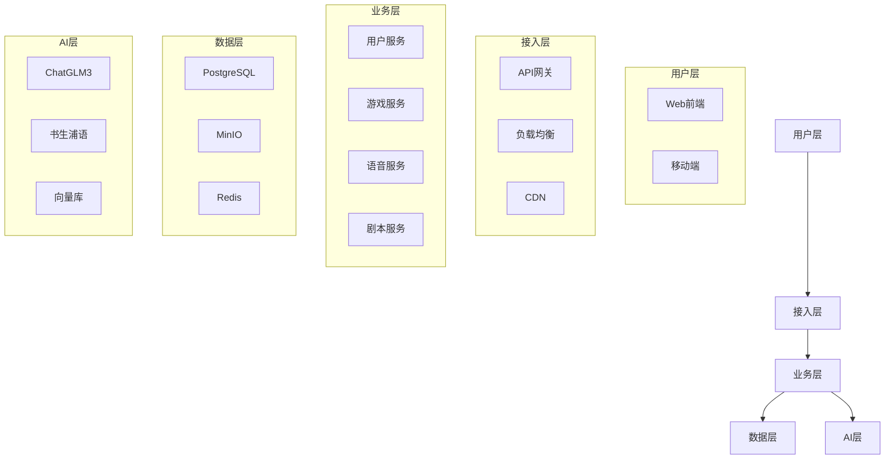

### 1.2 业务架构
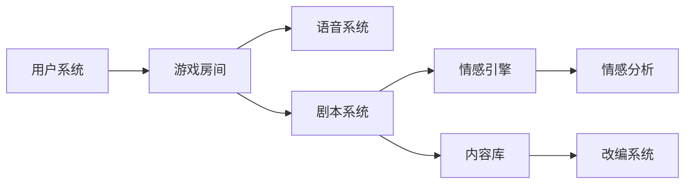

## 二、功能模块图

### 2.1 核心功能模块
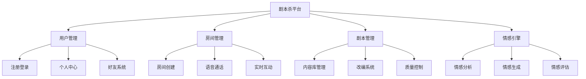

### 2.2 技术组件图
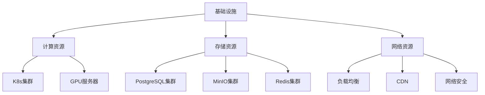

## 三、数据流向图

### 3.1 用户数据流
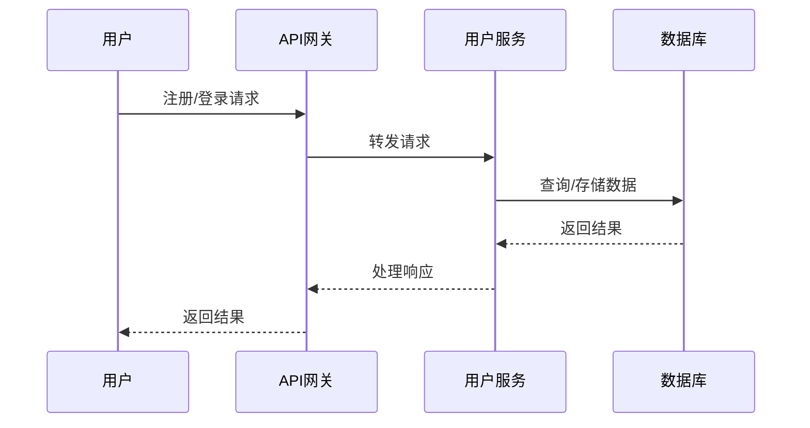

### 3.2 游戏数据流
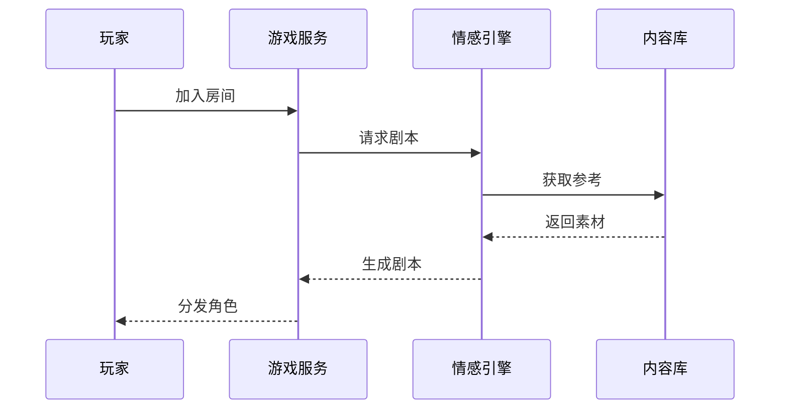

## 四、部署架构图

### 4.1 开发环境
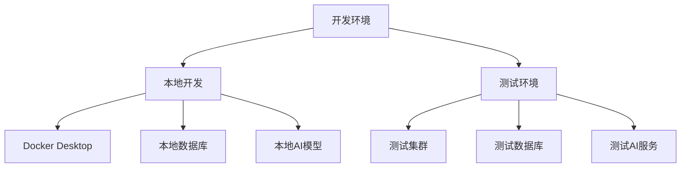

### 4.2 生产环境
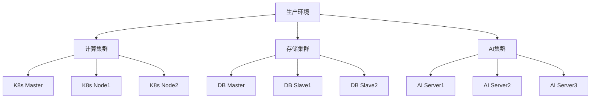

## 五、监控架构图

### 5.1 系统监控
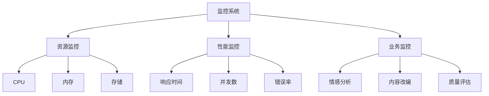

### 5.2 告警系统
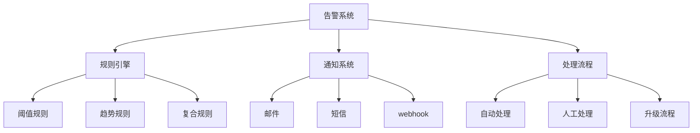

## 六、安全架构图

### 6.1 安全防护
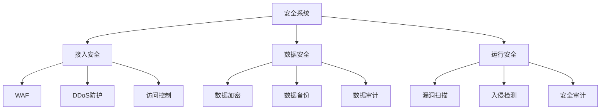
